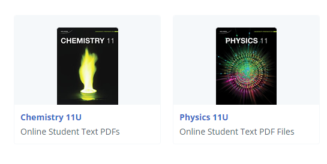

## Nelson Book Pirater, The Problem:
A Canadian textbook hub available at [mynelson.com](https://mynelson.com) only allows you to view pages in your browser. You can download the pdf's one by one but the pages are spread across many directories. This is difficult for anyone wanting to freely own their books.

## What does this script do?

Enter in your account credentials, and you'll be able to view the all textbooks attached to your account and instantaneously download all the contents from them into a neat folder. 

Port your eBooks to your local devices, distribute, etc..

## How to use?

Ensure you have a version of [Node.js](https://nodejs.org/en) equal to or greater than v20.

Download `nelsonfrick.mjs` and run it with node with the following terminal command: `node nelsonfrick.mjs` which can be done with an app called Powershell on Windows. Follow the prompted instructions to download your books.

This script may stop working due to Nelson updates. Please create a Github issue if you encounter any problems.
